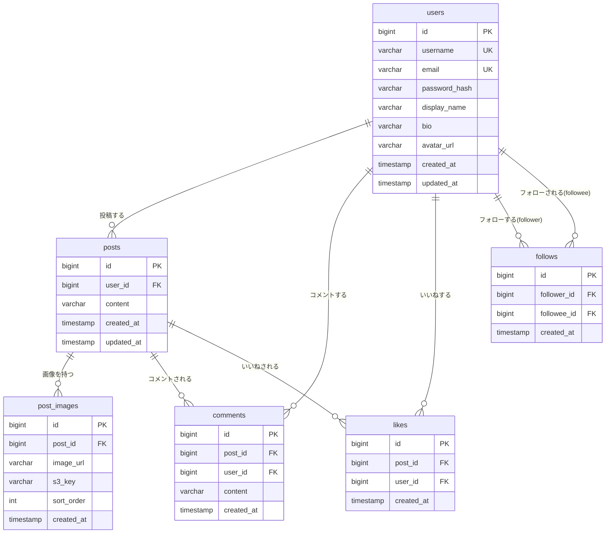

# ER図

## エンティティ関連図

## テーブル定義

### users（ユーザー）
| カラム名 | 型 | 制約 | 説明 |
|----------|----|------|------|
| id | bigint | PK | ユーザーID |
| username | varchar(50) | UNIQUE, NOT NULL | `@username`表示用の一意なユーザー名 |
| email | varchar(255) | UNIQUE, NOT NULL | ログインに使用するメールアドレス |
| password_hash | varchar(255) | NOT NULL | ハッシュ化済みパスワード |
| display_name | varchar(50) | NOT NULL | 画面表示用のニックネーム |
| bio | varchar(160) | NULL可 | 自己紹介文 |
| avatar_url | varchar(255) | NULL可 | アイコン画像のURL（S3） |
| created_at | timestamp | NOT NULL | 作成日時 |
| updated_at | timestamp | NOT NULL | 更新日時 |

### posts（投稿）
| カラム名 | 型 | 制約 | 説明 |
|----------|----|------|------|
| id | bigint | PK | 投稿ID |
| user_id | bigint | FK → users.id, NOT NULL | 投稿者 |
| content | varchar(280) | NOT NULL | 投稿本文 |
| created_at | timestamp | NOT NULL | 投稿日時 |
| updated_at | timestamp | NOT NULL | 更新日時 |

### post_images（投稿画像）
| カラム名 | 型 | 制約 | 説明 |
|----------|----|------|------|
| id | bigint | PK | 画像ID |
| post_id | bigint | FK → posts.id, NOT NULL | 紐づく投稿 |
| image_url | varchar(255) | NOT NULL | S3上の画像URL |
| s3_key | varchar(255) | NOT NULL | S3オブジェクトキー（削除時に使用） |
| sort_order | int | NOT NULL | 表示順 |
| created_at | timestamp | NOT NULL | 作成日時 |

### comments（コメント）
| カラム名 | 型 | 制約 | 説明 |
|----------|----|------|------|
| id | bigint | PK | コメントID |
| post_id | bigint | FK → posts.id, NOT NULL | コメント対象の投稿 |
| user_id | bigint | FK → users.id, NOT NULL | コメント投稿者 |
| content | varchar(140) | NOT NULL | コメント本文 |
| created_at | timestamp | NOT NULL | コメント日時 |

### likes（いいね）
| カラム名 | 型 | 制約 | 説明 |
|----------|----|------|------|
| id | bigint | PK | いいねID |
| post_id | bigint | FK → posts.id, NOT NULL | いいね対象の投稿 |
| user_id | bigint | FK → users.id, NOT NULL | いいねしたユーザー |
| created_at | timestamp | NOT NULL | いいね日時 |

制約: `UNIQUE(post_id, user_id)` — 同一ユーザーによる同一投稿への重複いいねを防止

### follows（フォロー関係）
| カラム名 | 型 | 制約 | 説明 |
|----------|----|------|------|
| id | bigint | PK | フォローID |
| follower_id | bigint | FK → users.id, NOT NULL | フォローする側のユーザー |
| followee_id | bigint | FK → users.id, NOT NULL | フォローされる側のユーザー |
| created_at | timestamp | NOT NULL | フォロー日時 |

制約: `UNIQUE(follower_id, followee_id)` — 同一ユーザーへの重複フォローを防止。`follower_id <> followee_id` を満たすこと（自己フォロー禁止）
