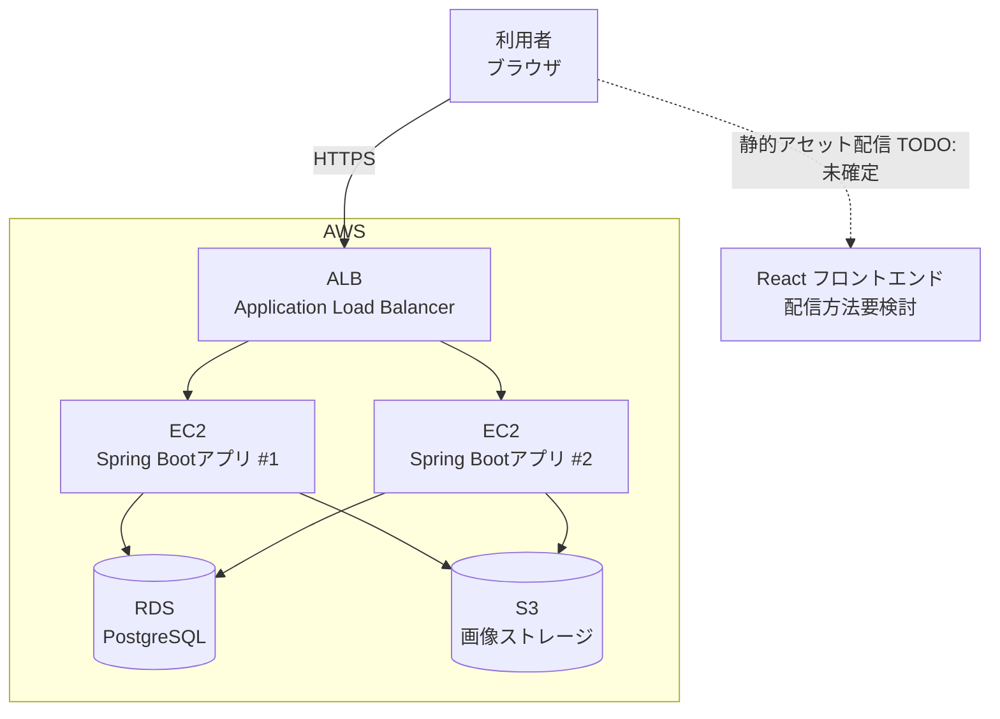

# インフラ構成図

> **Note:** AWS上で構築するかどうかは未確定だが、構築する場合はALB＋EC2＋RDS＋S3という構成方針は決定済み。本ドキュメントはその前提での想定構成であり、学習目的のため詳細スペック（インスタンスタイプ・台数等）は概略で示す。

## 構成図

## 構成要素

| 要素 | 役割 | 台数/スペックの想定 |
|------|------|---------------------|
| ALB（Application Load Balancer） | HTTPSでのリクエストを受け付け、EC2群に振り分ける | 1台（マネージドサービス） |
| EC2 | Spring Bootアプリケーションを実行するアプリケーションサーバー | 学習目的のため最小構成（1〜2台程度）を想定。将来的にオートスケールも検討 |
| RDS（PostgreSQL） | アプリケーションデータの永続化 | シングルインスタンス想定（学習用途のため冗長化は必須としない） |
| S3 | 投稿画像・アイコン画像の保存先 | オブジェクトストレージ、EC2またはフロントエンドから署名付きURLでアップロード（方式は要件定義時に確定） |
| React フロントエンド | SPAとして配信 | 配信方法（S3＋CloudFront等）は未確定のためTODO |

## 未確定事項（TODO）

- AWS上でサーバーを構築するかどうか自体が未確定（本図は構築する場合の想定）
- 画像アップロード方式: EC2経由でS3にアップロードするか、フロントエンドからS3へ署名付きURLで直接アップロードするか
- フロントエンド（React）の配信方法・ホスティング先
- HTTPS証明書の管理（ACM想定）、ドメイン・DNS構成
- 環境分離（開発／本番）の要否
