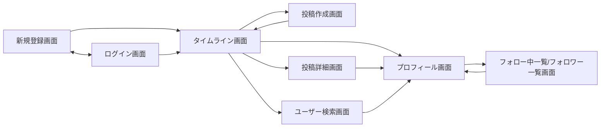

# 画面設計

## 画面一覧

| No | 画面名 | 概要 | 認証要否 |
|----|--------|------|---------|
| 1 | 新規登録画面 | メールアドレス／パスワードでの新規登録 | 不要 |
| 2 | ログイン画面 | メールアドレス／パスワードでのログイン | 不要 |
| 3 | タイムライン画面 | フォロー中ユーザーの投稿一覧 | 必要 |
| 4 | 投稿作成画面 | テキスト＋画像添付で投稿を作成 | 必要 |
| 5 | 投稿詳細画面 | 投稿本文＋コメント一覧＋コメント投稿フォーム | 必要 |
| 6 | プロフィール画面 | ユーザー情報・投稿一覧・フォロー/フォロワー数 | 必要 |
| 7 | フォロー中一覧／フォロワー一覧画面 | フォロー中／フォロワーのユーザー一覧 | 必要 |
| 8 | ユーザー検索画面 | ユーザー名・表示名でのユーザー検索 | 必要 |

## 各画面の詳細

### 1. 新規登録画面
- 表示要素: メールアドレス入力欄、パスワード入力欄、ユーザー名入力欄、登録ボタン、ログイン画面への導線リンク
- 主な操作: 入力内容を送信して新規登録
- 遷移先: 登録成功 → タイムライン画面 / ログインへのリンク → ログイン画面

### 2. ログイン画面
- 表示要素: メールアドレス入力欄、パスワード入力欄、ログインボタン、新規登録画面への導線リンク
- 主な操作: ログイン
- 遷移先: ログイン成功 → タイムライン画面 / 新規登録へのリンク → 新規登録画面

### 3. タイムライン画面
- 表示要素: フォロー中ユーザーの投稿一覧（投稿者アイコン・表示名・`@username`・本文・画像・いいね数・コメント数・投稿日時）、投稿作成への導線
- 主な操作: いいね、投稿詳細への遷移、投稿者名クリックでプロフィールへ遷移、無限スクロールで追加読み込み
- 遷移先: 投稿クリック → 投稿詳細画面 / 投稿者名クリック → プロフィール画面 / 投稿作成ボタン → 投稿作成画面

### 4. 投稿作成画面
- 表示要素: 本文入力欄、画像添付ボタン（複数選択可）、添付画像プレビュー、投稿ボタン
- 主な操作: テキスト入力、画像添付・削除、投稿送信
- 遷移先: 投稿完了 → タイムライン画面

### 5. 投稿詳細画面
- 表示要素: 投稿本文・画像、いいね数・コメント数、コメント一覧（コメント投稿者アイコン・表示名・`@username`・本文）、コメント投稿フォーム
- 主な操作: いいね、コメント投稿、投稿者・コメント投稿者名クリックでプロフィールへ遷移、投稿者本人の場合は投稿削除
- 遷移先: ユーザー名クリック → プロフィール画面

### 6. プロフィール画面
- 表示要素: アイコン・表示名・`@username`・自己紹介、フォロー中数・フォロワー数、本人の投稿一覧、フォロー/フォロー解除ボタン（他ユーザー閲覧時のみ）、プロフィール編集ボタン（本人閲覧時のみ）
- 主な操作: フォロー／フォロー解除、フォロー中/フォロワー数クリックで一覧表示、プロフィール編集
- 遷移先: フォロー中/フォロワー数クリック → フォロー中一覧／フォロワー一覧画面

### 7. フォロー中一覧／フォロワー一覧画面
- 表示要素: ユーザー一覧（アイコン・表示名・`@username`・フォローボタン）
- 主な操作: フォロー／フォロー解除、ユーザークリックでプロフィールへ遷移
- 遷移先: ユーザークリック → プロフィール画面

### 8. ユーザー検索画面
- 表示要素: 検索ボックス、検索結果一覧（アイコン・表示名・`@username`・フォローボタン）
- 主な操作: キーワード入力・検索、フォロー／フォロー解除、ユーザークリックでプロフィールへ遷移
- 遷移先: ユーザークリック → プロフィール画面

## 画面遷移図

